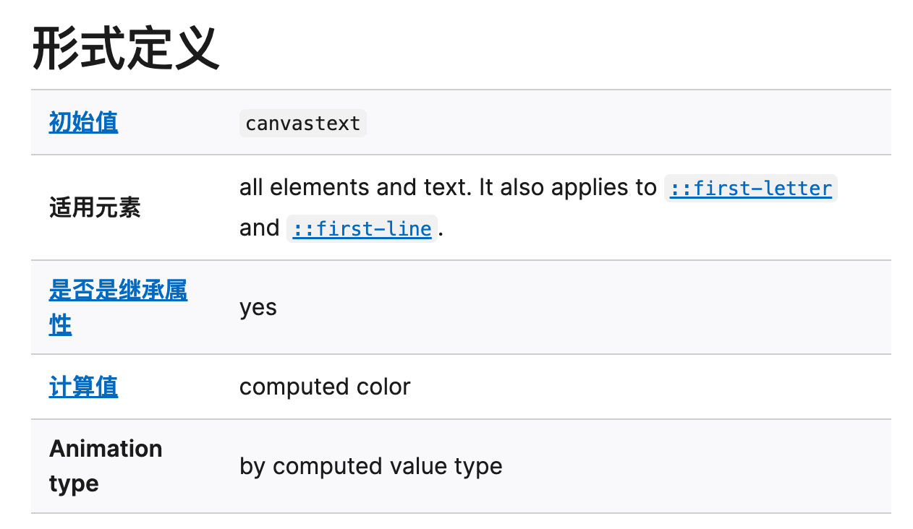
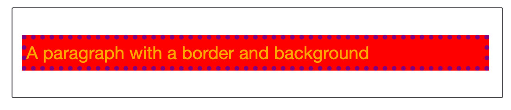

# CSS

CSS 层叠样式表（Cascading Style Sheets）

## 冲突规则

### 层叠与继承

样式表层叠，简单的说就是 CSS 的规则顺序很重要，当两条同级别的规则应用到同一个元素时，写在后面的就是实际使用的规则

### 优先级

浏览器根据优先级来决定使用哪条规则，优先级高的规则会覆盖优先级低的规则

### 继承

继承需要在上下文中理解，一些设置在父级元素上的 CSS 是可以被子元素继承的，有些则不能比如 `width`、`padding`、`margin`、`border`

更多的信息可以在查看属性的形式定义，比如 `color` 的形式定义如下：


## 理解继承

继承可以通过常识去判断，比如如果每个元素都继承了 `width` 那么 CSS 将会变得非常难用；如果每个元素都继承 `border` 这不会是我们想要的效果。

### 控制继承

CSS 提供了五个通用属性值来控制继承，每个 CSS 属性都接收这些值。

`inherit`：继承父元素的值  
`initial`：使用属性的默认值  
`revert`：使用浏览器的默认样式，多数情况下类似于 `unset`  
`revert-layer`：使用上一个层叠层中的值。
`unset`：将属性重置为自然值，如果属性是继承的，则相当于 `inherit`，否则相当于 `initial`。

### 重设所有属性值

可以通过简写属性 `all` 来重设所有属性值，比如:

```CSS
div {
  all: revert;
}
```

## 理解层叠

层叠应用规则有三个要素需要考虑，根据重要性排序如下，后面的更重要：

1. 资源顺序
2. 优先级
3. 重要程度

### 资源顺序

当有超过一条规则，且都是相同的权重时，那么后面的规则将会应用

### 优先级

不同类型的选择器有不同的分值，把这些分值相加就得到特定选择器的权重，然后就可以进行匹配

优先级算法：

一个选择器的优先级由三个不同的值（或分量）相加，可以认为是百、十、个，如：100（或 1-0-0）。  

三位数的三个位数含义分别是：

- ID：选择器中包含 ID 的个数为百位的分数
- 类：选择器中包含类选择器、属性选择器或者伪类的个数为十位的分数
- 元素：选择器中包含元素、伪元素选择器的个数为个位的分数

> 通用选择器（ `*` ）、组合符（`+`、`>`、`~`、`''`）和调整优先级的选择器（`:where()`）不会影响优先级。

否定（`:not()`）和任意匹配（`:is()`）伪类本身对优先级没有影响，但它们的参数则会带来影响。参数中对优先级算法有贡献的参数的优先级的最大值将作为改伪类选择器的优先级。

例：
| 选择器 | ID | 类 | 元素 | 优先级|
| - | - | - | - | - |
| `h1` | 0 | 0 | 1 | 0-0-1 |
| `h1 + p::first-letter` | 0 | 0 | 3 | 0-0-3 |
| `li > a[href*="en-US"] > .inline-warning` | 0 | 2 | 2 | 0-2-2 |
| `#identifier` | 1 | 0 | 0 | 1-0-0 |
| `button:not(#mainBtn, .cta)` | 1 | 0 | 1 | 1-0-1 |

### 内联样式

内联样式（即行内样式）优先级高于所有普通样式，可以理解为 1-0-0-0

### !important

`!important` 可以覆盖所有上面的优先级计算包括内联样式，

除了非常情况不应该使用 `!important` 

## CSS 位置的影响

CSS 声明的优先级取决于定义它的样式表和级联层

### 覆盖声明的顺序：

相互冲突的声明按一下顺序应用，后一种会覆盖前一种：

- 用户代理样式中的声明（浏览器器默认样式）
- 用户样式表中的常规声明（由用户设置的自定义样式）
- 作者样式表中的常规声明（web 开发人员设置的样式）
- 作者样式表中的 `!import` 声明
- 用户样式表中的 `!import` 声明
- 用户代理样式表中的 `!import` 声明

## 级联层的顺序

[@layer](https://developer.mozilla.org/zh-CN/docs/Web/CSS/@layer) 级联层属于高级的主题，并不常用。

在级联层中声明 CSS 优先级是由层的生命顺序来决定的，在任何层外声明的 CSS 样式会被按声明的顺序组合在一起，形成一个未命名的层，这个层会被放在所有命名层的后面。

对于存在冲突的样式，后面的层会覆盖先定义的层。但对于 `!import` 标记的样式，顺序相反——先前层中的 `!import` 比后面层中的 `!import` 优先级高。

[级联层顺序 demo](https://developer.mozilla.org/zh-CN/docs/Learn/CSS/Building_blocks/Cascade_and_inheritance#%E7%BA%A7%E8%81%94%E5%B1%82%E7%9A%84%E9%A1%BA%E5%BA%8F)



```CSS
@layer  secondLayer,firstLayer;

p { /* 0-0-1 */
  background-color: red;
  color: grey !important;
  border: 5px inset purple;
}
p#addSpecificity { /* 1-0-1 */

  border-style: solid !important;
}

@layer firstLayer {
  #addSpecificity { /* 1-0-0 */
    background-color: blue;
    color: white !important;
    border-width: 5px;
    border-style: dashed !important;
  }
}

@layer secondLayer {
  p#addSpecificity { /* 1-0-1 */
    background-color: green;
    color: orange !important;
    border-width: 10px;
    border-style: dotted !important;
  }
}
```
```html
<p id="addSpecificity">
  A paragraph with a border and background
</p>
```