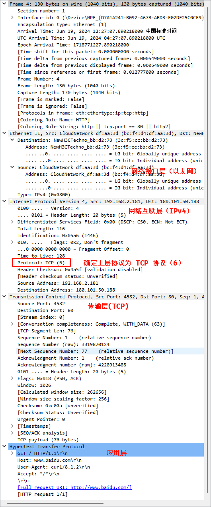
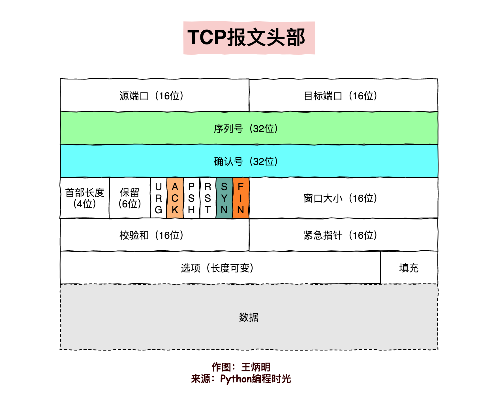
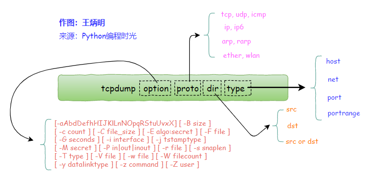

# TCP



网络包协议如下：

-- 以太网--
0 ～ 12 目的地 MAC
12 ～ 24 源地址 MAC
24 ～ 28 协议版本（ipv4）
-- IP 层
28 ～ 30 版本
30 ～ 32 DSCP
32 ～ 36 Length
36 ～ 40Identification
40 ～ 44 Flags 和 Fragment Offset
44 ～ 46 TTL
46 ～ 48 协议，TCP 则是 6
48 ～ 52 Header Checksum
52 ～ 60 源地址 IP
60 ～ 68 目的地 IP
-- TCP

TCP 报文格式



## tcpdump

一款 sniffer 工具，是 Linux 上的抓包工具，嗅探器



```bash
# 监听 www.ginlon.site 的数据包
tcpdump host www.ginlon.site

# 访问 www.ginlon.site
curl www.ginlon.site
```

单个包格式如下：

```bash
23:27:55.323895 IP ginlons-air.63713 > 101.133.153.78.http: Flags [S], seq 3115121999, win 65535, options [mss 1460,nop,wscale 6,nop,nop,TS val 514433993 ecr 0,sackOK,eol], length 0
```

第一列： 时分秒毫秒时间戳  
第二列： 网络协议 IP  
第三列： 发送方地址和端口号，其中 ginlons-air 是发送方主机名，63713 是发送方端口号  
第四列：箭头，表示数据包的方向  
第五列：接收方地址和端口号  
第六列：冒号  
第七列：数据包内容，包括 Flags 标识符，seq 号，ack 号，win 窗口，数据长度 length，其中 [P.] 表示 PUSH 标志位为 1，更多标识符见下面。

Flags 标识符如下：

`[S]` SYN，开始连接
`[P]` PSH，推送数据
`[F]` FIN，结束连接
`[R]` RST，重置连接
`[.]` 其他情况，如 ACK，URG，ECE，CWR

[tcpdump](https://www.cnblogs.com/wongbingming/p/13212306.html)
