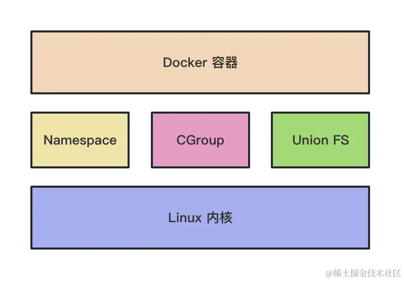

# Docker 手册

### 构建程序容器镜像

#### 程序根目录中添加配置文件`Dockerfile`

```dockerfile
FROM node:18-alpine
WORKDIR  /app
COPY . .
RUN yarn install --production
CMD ["node", "src/index.js"]
```

`FROM` 表示基于`node:18-alpine`镜像构建
在 /app 下创建工作目录
将当前目录下的所有文件复制到工作目录
使用 yarn 安装依赖
指定运行时的命令为 node src/index.js

#### 构建镜像

```bash
docker build -t getting-started .
```

`-t` 镜像的标记，可以通过标记引用镜像
最后的`.` 表示在当前目录中寻找`Dokerfile`配置文件
`--progress plain` 打印构建过程中的详细输出，用于检查构建过程中的错误

##### 构建跨平台镜像

> 由于 m1 mac 是 arm 架构，构建容器生成的镜像都是 arm 架构的镜像，但服务器一般是 amd 架构，因此我们需要一个构建跨平台镜像的工具。docker 官方提供的 buildx 就可以实现此功能。

1. 安装 Docker Buildx，新版 docker 内置了此工具
2. 启动 Docker Buildx

```bash
docker buildx create --user
```

该命令将创建一个新的构建器实例，并将其设置为当前终端会话的活动构建器。

3. 构建多平台镜像

```bash
docker buildx build --platform linux/arm64,linux/amd64 -t your-image-name .
```

4. 推送

```bash
docker buildx build --platform linux/amd64,linux/arm64 -t your-username/your-image-name:tag --push .
```

### 运行容器

```bash
docker run -d -p 80:80 docker/getting-started
# 可以缩写为以下形式
docker run -dp 80:80 docker/getting-started

# 启动已有容器
docker start [contianer]
```

`-d` 以分离模式（detached mode）运行容器，后台运行容器，不会占用当前终端控制权
`-p` 80:80 将主机的 80 端口映射到容器的 80 端口，允许从主机的 80 端口访问容器的 80 端口
`getting-started` 镜像名

### 获取容器信息

```bash
docker ps
```

### 停止容器

```bash
docker stop <the-container-id>
```

### 删除容器

```bash
docker rm <the-continer-id>
# 强制停止并删除
docker rm -f <the-continer-id>
```

### 分享容器

#### 创建仓库

[https://hub.docker.com/repository/docker/ginlon/getting-started/general](https://hub.docker.com/repository/docker/ginlon/getting-started/general)

#### 本地登入 dockerhub 账户

```bash
docker login -u 用户名
```

或者使用令牌访问
[Create and manage access tokens](https://docs.docker.com/go/access-tokens/)

#### 关联命名空间

使用 docker tag 命令关联命名空间

```bash
docker tag getting-started ginlon/getting-started
```

#### 推送

```bash
docker push ginlon/getting-started:tagname
// tagname 不传默认 latest
```

### 数据持久化

#### 创建卷（volume）

```bash
docker volume create todo-db
```

#### 挂载卷

```bash
docker run -dp 3000:3000 -v todo-db:/etc/todos getting-started
```

`-v` 这是一个选项，用于将 Docker 卷（Volume）**todo-db** 挂载到容器内的路径 **/etc/todos**。通过这样的挂载，容器内的数据可以持久化到主机上的**todo-db**卷中，这样即使容器被停止或删除，数据也会保留在主机的卷中。

> demo 程序使用的数据库，将数据存储在 /etc/todos 目录中的单个文件中

#### 查看卷信息

```bash
docker volume inspect todo-db
```

### bind mounts

#### 启动一个开发容器

```bash
 docker run -dp 3000:3000 \
    -w /app -v "$(pwd):/app" \
    node:18-alpine \
    sh -c "yarn install && yarn run dev"
```

`dp 3000:3000` 同前，以分离模式运行，并且映射终端
`-w /app` 设置容器的当前工作路径，命令将在此执行
`-v "${pwd}:/app"` 将主机当前的`getting-started/app`路径挂载绑定（链接, bind mode）到容器的`/app`目录。
注意：Docker 的 bind mount 模式需要绝对路径，所以这个例子中使用了`pwd`获取工作目录的绝对路径。
`node:18-alpine` 使用的镜像
`sh -c "yarn install && yarn run dev"` 命令，使用`sh`运行 shell

#### 查看容器日志

```bash
docker logs -f <container-id>
```

### 多容器程序

默认容器是隔离运行的，无法获取本机器上容器外其他进程或容器的任何信息。
容器间的通讯可以通过网络（networking）进行。

> 如果两个容器在一个相同的网络上，它们之间总是可以进行通信

#### 开启 MySQL

有两种方式可以将一个容器添加到网络中

1. 开始时分配
2. 连接一个现有容器

#### 创建一个网络

```bash
docker network create todo-app
```

#### 启动 MySQL 容器并添加到网络

```
docker run -d \
    --network todo-app --network-alias mysql \
    -v todo-mysql-data:/var/lib/mysql \
    -e MYSQL_ROOT_PASSWORD=secret \
    -e MYSQL_DATABASE=todos \
    mysql:8.0
```

`-d` 表示“后台运行”（Detached mode）
`--network todo-app` 将容器连接到名为 todo-app 的 Docker 网络。Dokcer 网络是一种可以让多个容器相互通信的网络，将容器连接到特定的网络可以方便容器之间的交互。
`--network-alias mysql` 这个选项为容器指定一个网络别名。在`todo-app`网络中，容器可以通过别名`mysql`进行通信，而不需要使用容器的 IP 地址。
`-v todo-mysql-data:/var/lib/mysql` 这个选项将名为`todo-mysql-data`的 Docker 卷（volume）挂载到容器内的`/var/lib/mysql`路径。通过这样的挂载，容器内的 MySQL 数据库数据可以持久化到主机上的`todo-mysql-data`卷中。
`-e MYSQL_ROOT_PASSWORD=secret` 通过环境变量指定了要创建的 MySQL 数据库的根用户密码为 'secret'。
`-e MYSQL_DATABASE=todos` 这个选项通过环境变量指定了要创建的 MySQL 数据库名称为 'todos'。
`mysql:8.0` 要使用的 Dokcer 镜像名称和版本标签

#### 查看数据库信息

```
docker exec -it <mysql-container-id> mysql -p
```

该命令会链接容器的 MySQL
显示所有数据库

```
mysql> SHOW DATABASES;
```

#### 链接 MySQL 服务器

使用 `nicolaka/netshoot` 镜像创建一个新容器，确保它连接到相同的 Dokcer 网络。

```
docker run -it --network todo-app nicolake/netshoot
```

`nicolaka/netshoot`是一个第三方镜像，它提供了一些网络诊断工具，用于调试和排查网络问题。这个镜像中包含了诸如 ping、nslookup、curl、traceroute 等工具。
使用`dig`命令查找名为`mysql`的主机的 IP 地址

```
dig mysql
```

#### 使用 MySQL 运行 App

启动一个容器，并配置环境变量

```
docker run -dp 3000:3000 \
  -w /app -v "$(pwd):/app" \
  --network todo-app \
  -e MYSQL_HOST=mysql \
  -e MYSQL_USER=root \
  -e MYSQL_PASSWORD=secret \
  -e MYSQL_DB=todos \
  node:18-alpine \
  sh -c "yarn install && yarn run dev"
```

通过 `docker logs <container-id>` 可以看到 mysql 的启动日志

#### 查看数据库

链接 mysql

```
docker exec -it <mysql-container-id> mysql -p todos
```

查表

```
mysql> select * from todo_items;
```

### Docker Compose

添加 compose 配置

```yaml
version: "3.8"
services:
  nest-app:
    build:
      context: ./
      dockerfile: ./Dockerfile
    depends_on: # 依赖容器
      - mysql-container
      - redis-container
    ports:
      - "3000:3000"
    networks: # 桥接网络
      - common-network
    restart: "always" # 重启策略
  mysql-container:
    image: mysql
    ports:
      - "3306:3306"
    volumes:
      - /Users/gaojinlong/ThisMac/coding/docker/mysql:/var/lib/mysql
    environment:
      MYSQL_ROOT_PASSWORD: "ginlon"
    networks: # 桥接网络
      - common-network
  redis-container:
    image: redis
    ports:
      - "6379:6379"
    volumes:
      - /Users/gaojinlong/ThisMac/coding/docker/redis:/data
    networks: # 桥接网络
      - common-network
networks: # 桥接网络，不指定也可以 docker 会创建默认的桥接网络
  common-network:
    driver: bridge
```

配置好后使用命令根据配置启动容器

```bash
docker-compose up
```

停止 compose

```bash
docker-compose -p <compose> down
```

### 重启策略

docker 提供了进程崩溃时重启进程的功能

```bash
docker run -d --restart=always --name=<container> <image-name>
```

`--restart` 默认值为 `no`
`always` 容器退出时总是重启
`on-failure` 只有非正常退出时候才重启，可以指定重启次数`on-failure:3`最多重启三次
`unless-stopped` 非手动停止总会重启
`always` 和 `unless-stopped` 的区别体现在 Docker Deamon（守护进程），当 docker 进程重启时 always 依然会重启容器，但 `unless-stopped` 则不会

### 其他命令

```bash
# 在容器和本机之间复制文件
docker cp ~/nginx-html/conf.d/defautl.conf nginx1:/etc/nginx/conf.d/default.conf
```

## Docker 基本原理

Namespace: 实现各资源的隔离
Control Group: 实现容器进程的资源访问限制
UnionFS: 实现容器文件的分层存储，镜像合并，额外添加可写层读写文件，可写层中挂载 volume 卷实现持久化

