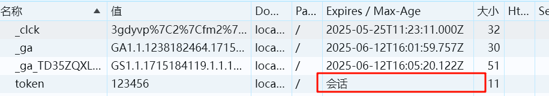
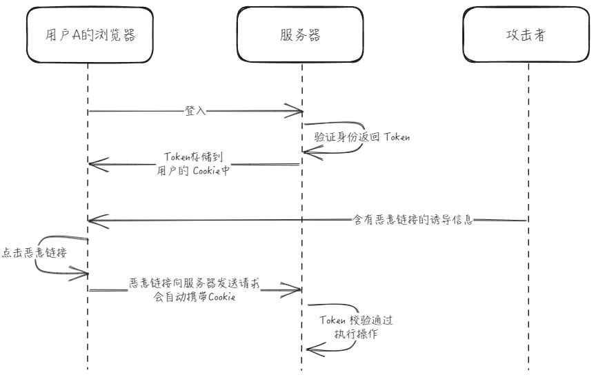
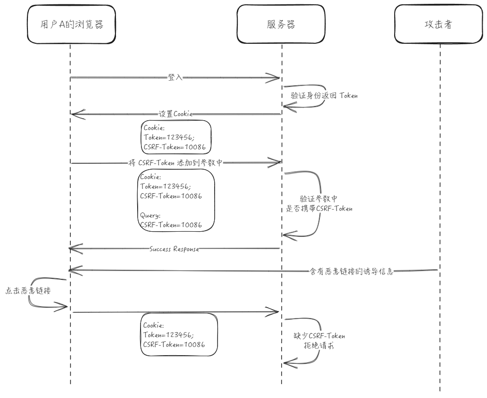

# Token 方案

## 前端存储方式对比

### Cookie

Cookie 是服务器发送到用户浏览器并保存在本地的一小段数据。并且下次向同一服务器再发起请求时，会自动将这些数据发送到服务器上。

因此 Cookie 可以用于存储用户的登录状态等信息。

在早期浏览器中没有现代存储 API（LocalStorage、SessionStorage） 时，Cookie 曾一度用于存储客户端数据，但是每次浏览器请求都回携带这些数据，会带来额外性能开销，因此通常**不建议使用 Cookie 存储数据**。

Cookie 可以通过 HTTP 头直接设置：

```http
HTTP/1.1 200 OK
Set-Cookie: <cookie-name>=<cookie-value>

[body]
```

浏览器会自动将 Cookie 存储在本地，并在下次请求时自动发送到服务器。

所以服务端可以在客户端不干涉的情况下完成数据的存储和传输。

但是 Cookie 本身还有一些不足和潜在的风险：

- Cookie 的大小限制在 4KB 左右，不适合存储大量数据。
- Cookie 会在每次请求中自动发送，可能会影响网络性能。
- Cookie 可以被 JavaScript 访问和修改，如果站点受到**跨站脚本(XSS)攻击**，可能会导致 Cookie 泄露。
- Cookie 可能会受到**跨站点请求伪造（CSRF）攻击**，因为浏览器会自动发送包含 Cookie 的请求，如果被恶意网站获取到用户的 Cookie，就可以伪造用户的身份发送请求。

随着浏览器的发展，部分问题已经有了相应的解决方案，我们通过实践来逐个说明

假设我们现在使用 Cookie 来存储用户的登入信息，如前面所说我们可以直接通过 HTTP 头来设置 Cookie：

```http
HTTP/1.1 200 OK
Set-Cookie: token=123456
```

#### Cookie 的过期时间

我们面对的第一个问题是，当我们关闭浏览器重新打开时，我们的登入信息就会丢失，这是因为在**默认情况下 Cookie 会在会话结束时会被自动清除**



可以通过设置 Cookie 的过期时间来修改 Cookie 的生命周期，这样即使关闭浏览器，在有效期内再次打开时 Cookie 仍然有效：

```http
HTTP/1.1 200 OK
Set-Cookie: token=123456; Expires=Wed, 21 Oct 2024 22:45:00 GMT
Set-Cookie: token=123456; Max-Age=3600
```

可以通过两个属性来设置 Cookie 的过期时间 `Expires` 或者 `Max-Age`，`Expires` 是一个 UTC 格式的时间字符串，表示 Cookie 的过期时间，`Max-Age` 是一个相对时间，表示 Cookie 的有效时间（单位为秒）。

需要注意的是 Cookie 的有效时间判断采用的是客户端的时间，因此不能完全依赖于这个时间来判断 Cookie 的有效性。

#### CSRF 攻击

接下来我们会遇到第二个问题 **CSRF（跨站请求伪造） 攻击**，先来解释下什么是 CSRF 攻击：

当用户登录服务器后，服务器会在用户的浏览器中设置一个 Cookie，用于标识用户的身份。此时攻击者可以通过一些方式诱使用户访问一个恶意网站，这个恶意网站会向服务器发送一个请求，由于用户已经登录，浏览器会自动携带 Cookie，服务器会认为这是一个合法的请求，从而执行攻击者的恶意操作。



在这个例子中，攻击者并没有直接获取到用户的 Cookie，而是通过一些方式冒用了用户的身份向服务器发送了一个请求，这就是 CSRF 攻击。

一些 CSRF 攻击示例：

```html
<!DOCTYPE html>
<html>
  <body>
    <!-- 通过 img 标签发起请求 -->
    

    <!-- 通过 form 表单发起请求 -->
    <!-- 可以看到并不能完全依赖 POST 请求来保证安全 -->
    <form id="form" action="http://www.example.com/api/transfer" method="POST">
      <input type="hidden" name="to" value="attacker" />
      <input type="hidden" name="amount" value="1000" />
      <input type="submit" value="Submit" />
    </form>
    <script>
      document.getElementById("form").submit();
    </script>

    <!-- 通过 script 标签发起请求 -->
    <script>
      // 在现代浏览器中，跨域请求默认不会携带 Cookie，且还有 SameSite 属性来限制 Cookie 的发送，因此这种方式通常不会成功
      fetch("http://www.example.com/api/transfer?to=attacker&amount=1000", {
        method: "GET",
        credentials: "include",
      });
    </script>
  </body>
</html>
```

有很多预防 CSRF 攻击的方法，比如遵循 `RESTful` 设计规范，使用 `CSRF Token` 等。

**遵循 `RESTful` 设计规范**

确保 GET 请求的**幂等性**，不会对服务器端资源产生影响，比如不要在 GET 请求中使用删除操作，这样即使被攻击者伪造了请求，也不会对服务器端资源产生影响。

不要在 POST 请求中使用查询参数，而是使用请求体来传递参数。

**使用 CSRF Token**

可以利用 CSRF 攻击只是冒用用户的身份，而并没有获取到用户的 Cookie 的特点，通过在 Cookie 中设置一个 CSRF Token，然后在每次需要验证身份的请求中都将这个 CSRF Token 添加到请求的载荷中（`body` 或者 `query` 中，显然不能放在 Cookie 中），这样即使攻击者冒用了用户的身份，但是由于没有这个 CSRF Token，服务器会拒绝这个请求。



CSRF 还可能发生在其他地方，如：可以上传图片的评论区，这里发起的攻击是同源的往往更加危险。

通常需要多种不相关安全措施进行[纵深防御（Defense in depth）](<https://en.wikipedia.org/wiki/Defense_in_depth_(computing)>)。

#### XSS 攻击

解决了 CSRF 攻击问题，我们还会遇到第三个问题 **XSS（跨站脚本）攻击**，再解释下什么是 XSS 攻击：

攻击者在网站上注入恶意脚本，当用户访问这个网站时，恶意脚本会在用户的浏览器中执行，从而获取用户的 Cookie 或者其他敏感信息。

这里就不讨论 XSS 攻击的实施方式了，重点看下我们关心的部分 **获取用户 Cookie**

客户端的 JavaScript 可以通过 `document.cookie` 来获取到当前域名下的所有 Cookie，这样如果站点受到 XSS 攻击，攻击者就可以获取到用户的 Cookie。

```JavaScript
// 获取当前域名下的所有 Cookie
console.log(document.cookie);
```

可以通过设置 `HttpOnly` 属性来阻止 JavaScript 访问 Cookie：

```http
HTTP/1.1 200
Set-Cookie: token=123456; HttpOnly
```

这样 JavaScript 就无法通过 `document.cookie` 来获取到这个 Cookie 了。

#### 跨域共享 Cookie

出于保证安全的目的，Cookie 有这比较严格的跨域限制，即使是不同的二级域名也不能共享 Cookie，比如 `api.example.com` 和 `www.example.com` 不能共享 Cookie。

想要在不同的二级域名之间共享 Cookie，可以通过设置 `Domain` 属性将 Cookie 的域名设置为顶级域名：

```http
HTTP/1.1 200
Set-Cookie: token=123456; Domain=example.com
```

但是这可能会引入一些安全风险，因为这样设置后，`example.com` 下的所有子域名都可以共享这个 Cookie，如果其中一个子域名存在安全漏洞，就可能导致整个域名的 Cookie 泄露。

还有一种方式，通过一个中心化的认证服务来管理用户的登录状态，这样服务集群或者多个不同站点之间都可以通过这个中心化的认证服务来共享用户的登录状态。

但是这样会引入单点故障，一旦认证服务出现问题，整个站点都将无法正常使用。


#### Cookie 小结

优点：

- 可以通过 `HttpOnly` 属性阻止 JavaScript 访问 Cookie，从而防止 XSS 攻击。
- 无需前端干预，由服务端自己维护。
- 现代浏览器对 Cookie 的安全性有了很多限制，相对安全。

缺点：

- Cookie 在每次请求中都会自动发送，可能会影响网络性能。
- 需要配合其他的安全措施来防止 CSRF 攻击。

### SessionStorage 和 LocalStorage

#### JWT Token

通过加密算法对信息进行加密，生成一个 Token，这个 Token 会包含用户的一些信息，比如用户的 ID、角色等，然后将这个 Token 发送给客户端，客户端在下次请求时会将这个 Token 发送给服务器，服务器通过解密 Token 来验证用户的身份。

这样就可以在多个服务节点之间共享用户的登录状态，而不需要依赖中心化的 Session 管理。

TODO:

- Token 生成步骤
- ...

### token 处理 将令牌存储在 Cookie 和 Local

Storage 中都有其优缺点，取决于具体的使用场景和安全需求。 Cookie： 优点： Cookie
在浏览器和服务器之间来回传递，因此在客户端和服务器之间共享令牌很方便。 可以设置
Cookie 的过期时间，使得令牌在一段时间后失效，增加了一定的安全性。 缺点： Cookie
在每次 HTTP
请求中都会自动发送，包括页面资源请求，因此可能会增加网络流量，降低性能。
可能会受到跨站点请求伪造（CSRF）攻击，因为浏览器会自动发送包含 Cookie
的请求，如果被恶意网站获取到用户的 Cookie，就可以伪造用户的身份发送请求。
存储容量有限，大约在 4KB 左右。 Local Storage： 优点：
可以存储大量数据，一般限制在 5MB 左右，比 Cookie
更适合存储较大的令牌或其他数据。
数据存储在客户端，不会在每次请求中自动发送，不会影响网络性能。 缺点： Local
Storage 中的数据在客户端和服务器之间不会自动传输，需要通过 JavaScript
明确获取并发送到服务器，因此相对于 Cookie，使用起来稍显麻烦。
由于数据存储在客户端，存在被恶意网站获取的风险，尤其是对于敏感数据，需要特别注意安全性。
综合考虑，对于令牌这种敏感信息，通常建议将其存储在 HttpOnly 的 Secure Cookie
中，以确保安全性和可用性。在某些情况下，如果需要存储大量数据或者不需要在每次请求中发送令牌，可以考虑使用
Local Storage。

## References

[【美团技术团队】前端安全系列（二）：如何防止 CSRF 攻击？](https://tech.meituan.com/2018/10/11/fe-security-csrf.html)

[OWASP Top Ten](https://owasp.org/www-project-top-ten/)

[【MDN】】HTTP Cookie](https://developer.mozilla.org/zh-CN/docs/Web/HTTP/Cookies)
