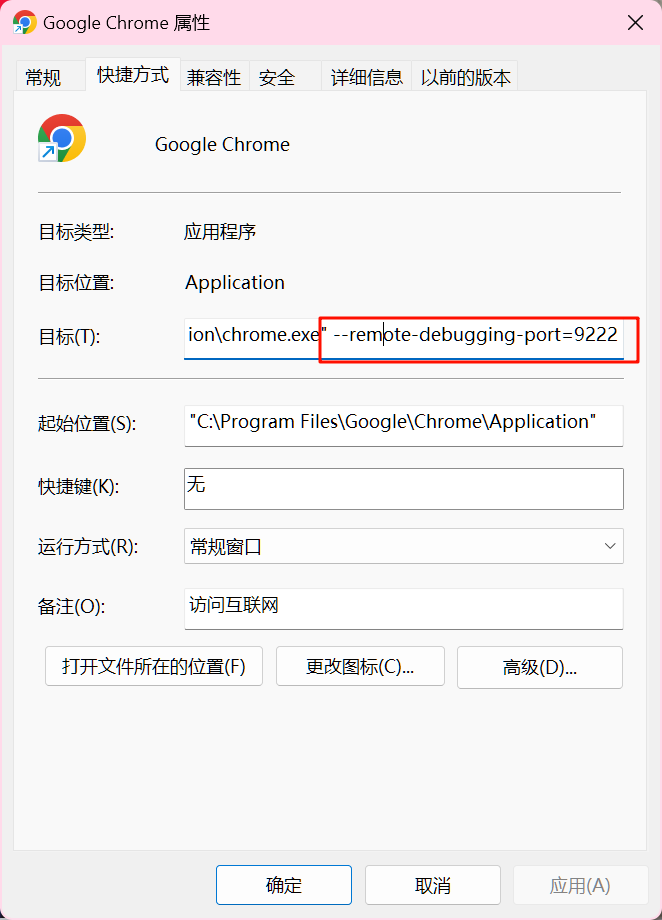

# vscode 调试

vscode 调试有两种模式，一种是 `attach` 模式，一种是 `launch` 模式。

两种模式的区别是`attach` 模式是在已经运行的 chrome 实例上调试，而 `launch` 模式是启动一个新的 chrome 实例进行调试。

launch 模式默认配置如下：

```json
{
  "configurations": [
    {
      "name": "Launch Chrome",
      "request": "launch",
      "port": 9222,
      "type": "chrome",
      "url": "http://localhost:3000",
      "webRoot": "${workspaceFolder}",
      "userDataDir": true,
      "runtimeExecutable": "/Applications/Google Chrome.app/Contents/MacOS/Google Chrome",
      "runtimeArgs": [
        "--auto-open-devtools-for-tabs", // 自动打开开发者工具
        "--remote-debugging-port=9222", // 远程调试端口
        "--incognito", // 无痕模式
        "--user-data-dir=/tmp/chrome_dev_profile" // 临时用户数据目录
      ],
      "sourceMaps": true, // 是否启用sourceMaps
      "file": "${workspaceFolder}/index.html", // vscode 启动静态服务器提供服务入口，可直接调试静态页面
      "console": "integratedTerminal", // 控制台信息输出到集成终端
      "skipFiles": [
        // 忽略的文件
        "<node_internals>/**",
        "node_modules/**"
      ]
    }
  ]
}
```

attach 模式默认配置如下：

```json
{
  "configurations": [
    {
      "name": "Attach to Chrome",
      "request": "attach",
      "port": 9222,
      "type": "chrome",
      "webRoot": "${workspaceFolder}"
    }
  ]
}
```

开启 chrome 的远程调试端口

1. 在 chrome 的启动参数中添加参数 `--remote-debugging-port=9222`
2. 在 vscode 中启动调试
