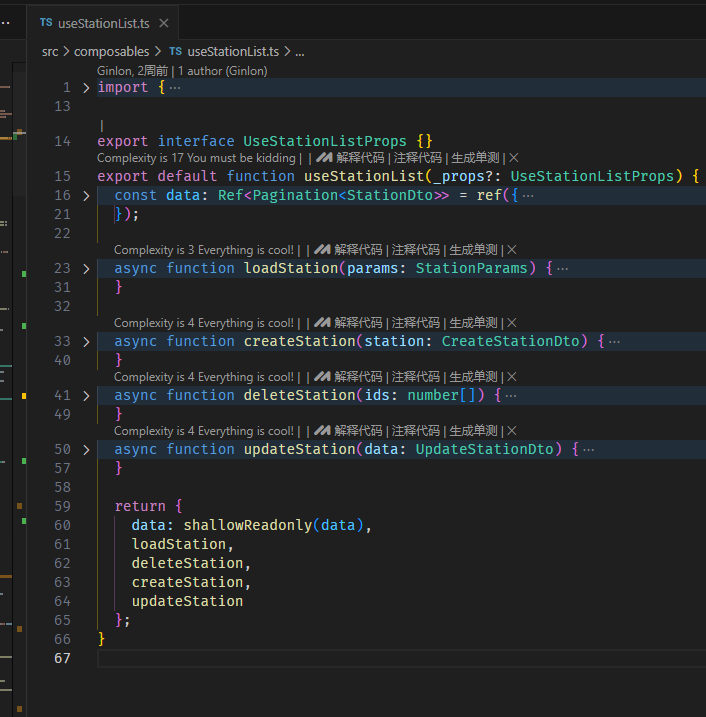

# 前端技术分享

## 前端架构演进


图源：[字节三年，谈谈一线团队如何搞工程化一（全景篇）](https://juejin.cn/post/7311596602249134106?share_token=143c8852-0d6b-4299-afcc-f922a2112c0f)

### 前奏

为什么要统一规范：

- 项目的可维护性
- 提升代码的复用性
- 降低团队成员之间的协作成本
- **可预测性**
  ...

从需求或者错误信息可以直观快速的定位到代码具体位置。

可以快速了解可以使用或修改哪些已有的代码（组件、依赖以及公用方法等）来解决问题或完成需求。

[How to Structure a Large Scale Vue Application](https://vueschool.io/articles/vuejs-tutorials/how-to-structure-a-large-scale-vue-application/)

#### 规范制定和推广


规范制定容易，推广困难

[【文档】代码规范（前端篇）](https://www.yuque.com/ginlon/tuqsd7/tl6hqdh1u2zcrs8p?singleDoc#)

#### 技术选型

- vue3
- typescript
- dayjs
- tinycolor2
- lodash
  ...

**建议推广：**

[pnpm](https://pnpm.io/zh/)

- 符号链接
- 幽灵依赖问题
- 低成本的 monorepo 方案

## 技术布道

### typescript

typescript 给前端带来类型描述的能力

```typescript
/**
 * 站点
 */
export interface StationDto {
  id: number;
  /**
   * 所在地区
   */
  address?: string;
  /**
   * 站点编号
   */
  code: string;
  /**
   * 是否有摄像头。1表示有，2表示没有
   */
  hasCamera: number;
  /**
   * 纬度
   */
  lat: number;
  /**
   * 经度
   */
  lon: number;
  /**
   * 纬度(北京坐标系）
   */
  latBj: number;

  /**
   * 经度(北京坐标系）
   */
  lonBj: number;
  /**
   * 站点名称
   */
  name: string;
  /**
   * 负责人列表展示
   */
  personList?: string;
  /**
   * 负责人
   */
  persons?: StationPersonDto[];
  /**
   * 站点图片名称
   */
  picName?: string;
  /**
   * 排序字段
   */
  sort: number;
  /**
   * 自动站类型
   */
  type?: string;
}
```

通过 Apifox 直接生成类型定义


#### 类型提示


#### 三方库的方法提示


#### 错误的静态检查


#### typescript 的真正价值

typescript 真正的价值在于它给前端提供了一套标准统一的语言体系,来描述具体的业务模型


### vue3

#### composables

vue2 整体是基于**面相对象的范式**进行的设计，而 vue3 更多的是吸收了**函数式编程的范式**进行设计

所以 vue2 中想要在多个组件之间复用代码的方式 mixin 实际上是一种**继承模型**

vue3 中 composables 则是更接近**组合模型**

众所周知 **组合优于继承**

**继承模型的缺陷**：

类层次耦合：父类和子类紧密耦合，父类变化往往会导致子类修改

脆弱性：继承层次越深，代码越脆弱

**组合的范式**

遵循 **SOLID** 原则：组合更符合 SOLID 原则，特别是**单一职责原则（SRP）**和**开闭原则（OCP）**。

#### MV\*

mvvm 和 mvc 本质上都在一件事情——**分层**

业务模型的代码实现和视图的渲染分离

**多端同构的基础**

所有业务模型提供的功能都抽离到 model 层，而不关心 view 层如何渲染，从而可以在不同端复用 model 层，结合 **monorepo** 可以非常方便的实现**单仓库**、**一套业务模型的实现**、**多端发布**。



[语雀 App 跨端技术架构实践](https://juejin.cn/post/7166549441066106917)

**代码的可测试性**

通过分离的难以测试的视图层，使得业务模型的代码变得可测试性更高。

#### 单向数据流和组件模型


## 项目中的部分问题

**"any script"**


**变异实体对象结构**


一个描述实体的对象在系统中应该是**不可变的**，且始终以实体本身的形状转移，直到视图层渲染时才可以根据需要从实体对象派生出合适的结构来驱动视图渲染。


**不良封装**


axios 本身提供了很多配置选项，这里封装过后没有暴露修改配置的能力，导致封装的通用方法不能通用

这个问题很容易发现并修改，但是并没有，说明项目的代码质量管控不足

很多组件也存在类似的问题，尤其是对 element 组件的二次封装，封装不恰当导致组件的配置能力被削减，通用组件不通用

范例：

`ElTable` 封装示例

```vue
<script setup lang="ts" generic="T extends Record<string, any>">
import { type TableColumnCtx, type TableInstance } from "element-plus";
import { isVNode, type VNode } from "vue";

export type Column<T = Record<string, any>> = Partial<TableColumnCtx<T>> & {
  slots?: {
    default?: string | VNode;
    header?: string | VNode;
  };
};

const _props = withDefaults(
  defineProps<{
    data: T[];
    columns: Column<T>[];
  }>(),
  {
    columns: () => [],
  }
);

const innerRef = defineModel<TableInstance | null>("innerRef");
</script>
<template>
  <ElTable
    ref="innerRef"
    :data
    stripe
    class="x-table"
    height="auto"
    header-cell-class-name="x-table__header-cell"
    cell-class-name="x-table__cell"
  >
    <template
      v-for="column in columns"
      :key="`${column.prop ?? column.index ?? column.type ?? column.label}`"
    >
      <ElTableColumn v-if="column.slots" v-bind="{ ...column }">
        <template
          v-for="[targetSlot, slot] of Object.entries(column.slots)"
          :key="targetSlot"
          #[targetSlot]="scope"
        >
          <component v-if="isVNode(slot)" :is="slot" />
          <slot v-else :name="slot" v-bind="scope" />
        </template>
      </ElTableColumn>

      <ElTableColumn v-bind="column" v-else></ElTableColumn>
    </template>

    <template v-for="slotName of Object.keys($slots)" #[slotName]="scope">
      <slot :name="slotName" v-bind="scope" />
    </template>
  </ElTable>
</template>

<style lang="scss" scoped>
.x-table {
  :deep() {
    .x-table {
      &__cell {
        height: 50px;

        font-family: Microsoft YaHei;
        font-weight: 400;
        font-size: 14px;
        color: #333333;
      }
      &__header-cell {
        height: 50px;
        background: rgba(42, 117, 173, 0.6);

        font-family: Microsoft YaHei;
        font-weight: 700;
        font-size: 14px;
        color: #ffffff;
      }
    }
  }
}
</style>
```

vue2 版本

```vue
<template>
  <el-table
    class="table-v2"
    stripe
    :height="$attrs.height || 'auto'"
    header-row-class-name="header-row"
    header-cell-class-name="header-cell"
    v-bind="$attrs"
    v-on="$listeners"
  >
    <template v-for="column in columns">
      <el-table-column
        v-bind="{ ...column, slots: undefined }"
        v-if="column.slots"
      >
        <template
          v-for="[targetSlot, slotName] of Object.entries(column.slots)"
          #[targetSlot]="scope"
        >
          <slot :name="slotName" v-bind="scope" />
        </template>
      </el-table-column>
      <el-table-column v-bind="column" v-else> </el-table-column>
    </template>

    <template v-for="slotName of Object.keys($scopedSlots)" #[slotName]="scope">
      <slot :name="slotName" v-bind="scope" />
    </template>
  </el-table>
</template>

<script>
export default {
  name: "TableForm",
  props: {
    columns: {
      type: Array,
      default: () => [],
    },
  },
  components: {},
  data() {
    return {};
  },
};
</script>

<style lang="scss" scoped>
.table-v2 {
  ::v-deep {
    .header-row {
    }
    .header-cell {
      background: var(--table-header-bg-color);
      color: var(--table-header-color);
    }
  }
}
</style>
```

## 推荐阅读

#### 书籍推荐

《重构：改善现有代码的设计》


《Vue.js 设计与实现》


《代码整洁之道》


#### 设计体系与组件库

[Ant Design](https://ant-design.antgroup.com/index-cn)

[Vuetify](https://vuetifyjs.com/zh-Hans/)

google 推行的设计体系

[MATERIAL DESIGN](https://m2.material.io/design/introduction#principles)

#### 技术大会

[2024 稀土开发者大会-前端未来](https://juejin.cn/live/5607057)
