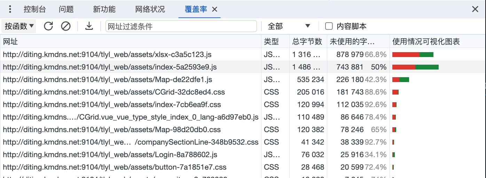

# 网页关键指标优化建议

> 原地址：[Web / Chrome ｜ 2023 年核心网页指标九大优化](https://www.bilibili.com/video/BV1xk4y1w7re/?share_source=copy_web&vd_source=e1b639c86f0cbba65e1ddf0de89f52ec)


## LCP（Largest Contentful Paint） 最大内容渲染时间

### 什么是 LCP ？

视口内可见的最大图片或文本块的呈现时间（相对于网页首次开始加载的时间）

LCP 是大多数网站都难以达到的指标


大多数网站中 LCP 的内容主要是图片


由此我们就得到了第一个优化方案

### 使用 `` 元素或预加载将图像纳入 HTML 中

需要注意的是，在目前主流的前端框架如 vue 中 `` 并不能被正确扫描到，因为框架最终会将所有代码编译为 javascript 因此也就不存在 img 标签。

可以通过 `<link rel="preload" href="" as="img">` 来预加载图片，但是我们只有一个 index.html 会一次性预加载所有图片，这样会导致首屏加载时间过长，而有些图片并不会一开始就被看到。

因此我们需要实现组件级的预加载，当我们需要加载某个组件时，再去预加载该组件的图片（在组件实例化之前就开始加载），这样就可以避免一次性加载所有图片，且还能够提前加载图片。

组件中的 img 标签和 link 标签都是在组件实例化之后才会被渲染，在实例化之前都是 javascript 代码，而浏览器是无法扫描 javascript 中的资源的，因此我们需要手动告知浏览器需要加载的资源有哪些。

通过 `new Image().src = ''` 可以立即触发图片的加载，相当于 `document.createElement('img')`(img 标签中有一个属性 loading，用于指示浏览器如何加载图像，默认值为 eager 表示立即加载)

我们只需要在路由切换之前执行 `new Image().src = ''` 即可，这样就可以在组件实例化之前就开始加载图片了，而不是等到组件实例化之后再去加载图片。

```ts
/** 路由守卫 */
router.beforeEach((to, from, next) => {
  const preloadImages = to.meta?.preloadImages as string[];
  /**
   * 图片预加载
   * @description 越过 js 代码分析，提前触发浏览器的图片加载机制
   * - chrome 中存在问题，当网络环境差时，开启高速 3G 节流模式时（或更慢），图片会加载两次，原因不详，尝试 corsOrigin、referrerPolicy 无果，疑似缓存未命中（缓存 key 组成不一致）或被清空
   * 停用节流模式时，预加载缓存正常命中，只加载一次图片。（ps: 这个节流模式 bug 真多）
   * - firefox 中不存在该问题，正常预加载一次图片，后续会正确显示命中缓存
   * 其他浏览器未测试
   */
  if (preloadImages.length) {
    preloadImages.forEach((item: string) => {
      const img = new Image();
      img.src = item;
      // img.referrerPolicy = "no-referrer"
      // img.crossOrigin = "anonymous"
    });
  }

  next();
});
```

可以借助 `onload` 事件实现顺序加载

```ts
const preloadImages = [];
router.beforeEach(() => {
  let i = 0;
  function loadImg(i) {
    new img() = new Image();
    img.src = preloadImages[i];
    img.onload = function () {
      loadImg(i + 1);
    };
  }
});
```

### Fetch Priority API

浏览器倾向于先渲染 css 和同步 javascript 等这些会阻塞其他内容加载的内容而非图像，使用 Fetch Priority API 可以告诉浏览器哪些资源是优先级较高的，从而优先加载这些资源。

```html


<link rel="preload" href="myUrl.jpg" as="image" fetchpriority="high" />
```

当 `fetchpriority` 设为 `low` 时可以实现与 `lazy` 相似的效果，当需要文件时才会获取

```html


```

### 使用 CDN 优化第一字节时间（TTFB）

CDN （内容分发网络）的优点：

- 就近访问
- 负载均衡
- 缓存
- 内容压缩
- 防 DDOS 攻击

就近访问和缓存都是优化第一字节时间的关键，就近访问可以减少网络延迟，缓存可以减少服务器的响应时间。

### 开启压缩算法（gzip）减小传输体积

nginx 配置 gzip

```bash
server{
  gzip on; # 是否开启gzip
  gzip_buffers 32 4K; # 缓冲(压缩在内存中缓冲几块? 每块多大?)
  gzip_comp_level 6; # 推荐6 压缩级别(级别越高,压的越小,越浪费CPU计算资源)
  gzip_min_length 1k; # 开始压缩的最小长度(再小就不要压缩了,意义不在)
  gzip_types application/javascript application/json text/css text/xml; # 对哪些类型的文件用压缩 如txt,xml,html ,css
  gzip_disable "MSIE [1-6]\."; #正则匹配UA，配置禁用gzip条件。此处表示ie6及以下不启用gzip（因为ie低版本不支持）
  gzip_http_version 1.1; # 开始压缩的http协议版本(可以不设置,目前几乎全是1.1协议)
  gzip_vary on; # 是否传输gzip压缩标志
  # 开启静态压缩，如果开启了gzip_static on;，那么nginx会在当前目录下查找.gz后缀的文件（缓存），如果存在，则直接返回该文件，不再压缩
  gzip_static on;
}
```

## CLS（Cumulative Layout Shift）累计布局偏移

### 显示定义元素的尺寸

显示定义元素的尺寸，浏览器初步渲染时就能以正确的尺寸渲染

最基本的便是指定元素宽高

```html

```

其次我们还可以使用 css 的 `aspect-ratio` 属性来指定宽高比，这样

```css
video {
  width: 100%;
  height: auto;
  aspect-ratio: 16 / 9;
}
```

此外还可以使用 `min-height` 为动态内容预留最小空间，减少对 CLS 的影响


### bfcache 缓存

bfcache 是浏览器的一个缓存机制，当用户点击浏览器的后退按钮时，浏览器会从缓存中恢复页面，而不是重新加载页面。

bfcache 会在用户离开页面时将完全渲染的页面的完整快照短时间存储在内存中。

bfcache 默认是开启的，但是有些 API 会导致 bfcache 失效，可以通过 DevTools 的 application 面板查看当前页面是否被缓存。


最常见的原因是 `cache-control` 的值为 `no-store`，这会禁用 bfcache，或者在使用 `unload` 事件，这也会禁用 bfcache。

还可以使用 NotRestoreReasons API 来查看页面为什么没有被缓存

> PS：没找到 API 文档

### 关于动画


使用 `top` 等属性会导致页面重排，即使他不会影响周围元素也会算入 CLS 中，因此我们应该尽量使用 `transform` 来实现动画。


`transform` 发生在合成层不会影响布局处理中的任何内容，也就不会算入 CLS 中。

## FID（First Input Delay）首次输入延迟

这些优化也有利于更新的指标 INP （Interaction to Next Paint）下次绘制交互

响应能力的关键在于确保不阻塞主线程

### 识别和消除长任务

chrome 将长任务定义为超过 50ms 的任务

javascript 本质上是单线程且贪婪的，一旦占据主线程就会一直执行，直到一个内容出现中断

可以使用 `setTimeout` 将非关键的任务延迟执行

```js
function yieldToMain() {
  return new Promise((resolve) => setTimeout(resolve));
}

async function longTask() {
  await yieldToMain();
  // do something
  await yieldToMain();
  // do something
}
```

还可以使 `requestIdleCallback` API 将长任务（通常是循环）拆解到多个帧的空闲时间中执行

```typescript
/**
 * 任务队列
 */
const tasks = [
  // some tasks...
];

function runTask(deadline: IdleDeadline) {
  // 当前帧剩余时间大于 0 且任务队列不为空时执行任务队列中的第一个任务，这里还可以考虑使用多个任务队列实现任务优先级的控制
  while (deadline.timeRemaining() > 0 && tasks.length > 0) {
    const task = tasks.shift();
    task();
  }

  if (tasks.length > 0) {
    requestIdleCallback(runTask);
  }
}

requestIdleCallback(runTask);
```

使用 `requestIdleCallback` 时需要注意，safari 浏览器不支持这个 API, 可以使用 polyfill 降级为 `setTimeout` 实现相近的效果

```typescript
(function () {
  if (!("requestIdleCallback" in window)) {
    const FRAME_DURATION = 1000 / 60;

    Object.defineProperty(window, "requestIdleCallback", {
      configurable: true,
      enumerable: false,
      writable: false,
      value: function (handler) {
        let startTime = Date.now();

        return setTimeout(function () {
          handler({
            didTimeout: false,
            timeRemaining: function () {
              return Math.max(0, FRAME_DURATION - (Date.now() - startTime));
            },
          });
        }, 1);
      },
    });
  }
})();
```

还有一些实验性的 API

[isInputPending()](https://developer.mozilla.org/en-US/docs/Web/API/Scheduling/isInputPending) : 判断是否有输入事件在等待处理
[scheduler.postTask()](https://developer.mozilla.org/en-US/docs/Web/API/Scheduler/postTask) : 可以给一个任务指定优先级
[scheduler.yield()](https://developer.mozilla.org/en-US/docs/Web/API/Scheduler/yield) : 允许 javascript 让步（yield）主线程给优先级更高的任务，但不会让步给同优先级的任务

### 避免不必要的 JavaScript

可以使用 chrome 的 coverage（覆盖率）工具来识别不必要的 javascript 代码，通过拆分的方式来减少一次性加载的 javascript 的体积，在空闲时间加载剩余的 javascript。




### 避免大的渲染更新

- 避免大范围的更新 dom

不管是有用的更新还是级联效应，都会导致主线程被阻塞，从而影响用户的交互体验。

可以通过缩小 dom 的 size 来减少 dom 更新的范围

lighthouse 面板会有相关的检查


- [css contain](https://developer.mozilla.org/zh-CN/docs/Web/CSS/contain) 属性可以限制 css 的影响范围不受外部影响，从而减少布局工作


[content-visibility](https://developer.mozilla.org/zh-CN/docs/Web/CSS/content-visibility) 是 css `contain` 的延伸，跳过不可见元素的布局和绘制（仅 chromium 支持）

### 避免使用 requestAnimationFrame API

这个 API 应该只用于渲染工作，如果安排了太多任务它会减慢自己的速度。

`requestAnimationFrame` API 和 css 动画的性能非常相近，但是 css 动画仍然是更好的选择。

为什么？关键是只要动画涉及的属性不引起 reflow（重新布局），就可以把采样操作移出主线程。

最常见的属性是 CSS transform，如果元素被提升为一个 layer，transform 属性就可以在 GPU 中进行，这意味着更好的性能，特别是在移动设备上。

## 其他优化

### 压缩图片

### DNS 预解析

```html
<link rel="dns-prefetch" href="https://fonts.googleapis.com/" />
```

### 减少重绘和回流

为元素设置 display: none，操作结束后再把它显示出来。因为在 display 属性为 none 的元素上进行的 DOM 操作不会引发回流和重绘。用一次回流替代多次回流

对于具有复杂动画的元素单独创建一个图层

## 扩展阅读

- [优化耗时较长的任务](https://web.dev/articles/optimize-long-tasks?hl=zh-cn)

- [通过预加载可选字体来防止布局偏移和不可见文本 (FOIT) 闪烁](https://web.dev/articles/preload-optional-fonts?utm_source=lighthouse&utm_medium=devtools&hl=zh-cn)

- [核心网页指标（core web vitals） 集合](https://web.dev/articles/vitals?hl=zh-cn)
