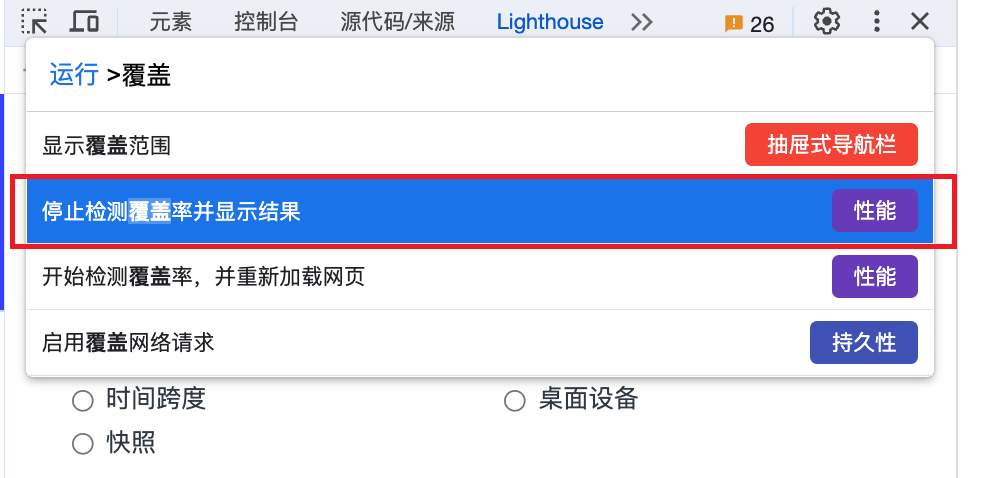
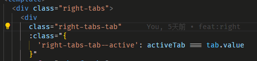
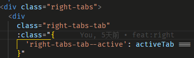

# 编程实践

## 项目搭建

推荐使用 `$ npm create vue@latest` 来创建基础项目，使用官方的预设模板可以避免许多繁琐的基础配置。



### 常用的依赖库和配置

善用开源库可以提高开发效率，这里推荐一些常用的依赖库和配置。

#### lodash-es

文档地址：https://www.lodashjs.com/

lodash-es 是 lodash 的 esm 版本，可以在 tree-shaking 的情况下减少打包体积，同时也可以使用按需加载的方式来减少打包体积。

常用的方法:

- `cloneDeep`, `debounce`, `throttle` 常见的不能在常见，不再赘述。

- `get` 获取对象的属性，主要有两个用途，一是避免因为对象不存在而报错，二是避免因为对象属性不存在而报错。

  ```typescript
  import { get } from "lodash-es";

  const obj = {
    a: {
      b: {
        c: 1,
      },
    },
  };

  console.log(get(obj, "a.b.c")); // 1

  console.log(get(obj, "a.b.d")); // undefined
  ```

#### dayjs

dayjs 是一个轻量的时间处理库，相比于 moment.js 体积更小，同时也提供了更好的 tree-shaking 支持。

#### ts-toolbelt

#### eslint + prettier + husky + lint-staged

#### 分支管理

## Typescript

常用类型的定义及命名方式

后端对于大量的类型定义已经有了非常成熟的约定范式，我们可以借鉴后端管理类型的方式来管理前端的的类型定义。

主要概念：

DTO（Data Transfer Object）数据传输对象，用于在不同的层之间传输数据，通常是一个纯数据对象，不包含任何业务逻辑。

```typescript
import { type Object as ObjectUtil } from "ts-toolbelt";

/** 查询接口 */
interface StudentDto {
  id: number;
  name: string;
  age: number;
}

/** 更新接口 */
interface StudentUpdateDto
  extends ObjectUtil.Optional<StudentDto, "name" | "age"> {}

/** 新增接口 */
interface StudentCreateDto extends Omit<StudentDto, "id"> {}

/** 删除接口 */
interface StudentDeleteDto extends Pick<StudentDto, "id"> {}
```

## 常用编程范式

### hook

学习自 React 的设计思想，使用函数式编程的方式实现面向对象编程中对象的作用，将相关的状态和行为封装在同一个作用域中。

```typescript
function useStudent() {
  const student = ref<StudentDto>({
    id: 0,
    name: "",
    age: 0,
  });

  const privateState = ref({
    // ...
  });

  const privateMethod = ref({
    // ...
  });

  function updateStudent(student: StudentUpdateDto) {
    // ...
  }

  function createStudent(student: StudentCreateDto) {
    // ...
  }

  function deleteStudent(student: StudentDeleteDto) {
    // ...
  }

  return {
    student,
    updateStudent,
    createStudent,
    deleteStudent,
  };
}
```

这种方式与 pinia 非常相似，但是需要注意这种方式和 pinia 的根本区别，hook 是一个函数可以调用多次返回多个不同的闭包，而 pinia 的 store 是一个单例模式，不论执行多少次都是同一个对象。

同时这也给我们提供了一个思路，那就是 hook 可以轻松地结合单例模式，实现全局状态的创建。

hooks 在 vue 中的最佳实践范式：所有的属性都以 ref 返回，这与 pinia 的设计不一致，因为一旦解构 pinia 的 store 就会失去响应式，而解构 hook 是一个比较常见的操作，因此为了避免这种情况，我们统一 hook 的返回值都是 ref。

同时也方便了 hook 返回的对象在不同的 hook 之间传递并保持响应性。

可能产生的问题是会有多个 `.value` 才能访问到需要的值，但这也是权衡后的结果，`.value` 也可以清晰地表达出这是一个响应式的值。

```typescript
export interface TimeProps {
  time: string;
  config: globalThis.Ref<DisplaySettingDto | undefined>;
}

export default function useTime(props: TimeProps) {
  const { config } = props;

  const time = ref(
    dayjs(props.time || new Date()).format("YYYY-MM-DD HH:mm:ss")
  );

  watch(config, (val) => {
    console.log("watch useTime", val);
  });

  return {
    time,
    config,
  };
}
```

### 异常情况处理

异常处理的经验主要介绍两个方面

#### 通过良好的类型定义来避免空值异常

有统计显示，空值异常是最常见的程序错误（没有之一），对程序空值异常的边界情况掌控很能体现一个程序员的经验和能力

实际上大部分的空值异常都可以通过代码的静态类型分析发现，当我们的类型定义的足够完善时 typescript 是能够帮我们检查出大部分的空值异常的。

我们应该尽可能的保持完善的类型定义以及避免使用 `!` 断言运算法。

#### 处理程序中的异常情况

在任何编程语言中，异常处理都是非常重要的一部分，但 `try catch` 语句却经常不被新手程序员所重视，因为他并不会直接影响程序的运行结果。

但实际上在经验丰富的程序员眼中 `try catch` 的重要程度堪比控制语句。

但也要注意，`try catch` 语句不应该滥用，异常只在需要被处理的时候才应该被处理，不应该被用来掩盖程序中的错误。

看下面一些在实践中使用 `try catch` 的例子

1. 接口加载、数据处理、loading 状态

```typescript
try {
  loading.value = true;

  const data = await fetchStudent();

  students.value = parseStudent(data);
} catch (error) {
  console.error("数据加载失败", error);
} finally {
  loading.value = false;
}

function fetchStudent() {
  const res = (await fetch("/api/student")).json();

  // 约定异常处理
  if (res.code !== 200) {
    throw new Error(res.message || "数据加载失");
  }

  return res.data;
}

function parseStudent(data: StudentDto) {
  if (data.length === 0) {
    throw new Error("暂无数据");
  }

  return data;
}
```

2. 表单验证

```typescript
function submit(form: StudentCreateDto) {
  try {
    validateForm(form);

    isLoading.value = true;

    // 提交表单
    const res = await fetch("/api/student", {
      method: "POST",
      body: JSON.stringify(form),
    });

    // 约定异常处理
    if (res.code !== 200) {
      throw new Error(res.message || "数据加载失");
    }

    console.log("提交成功");
  } catch (error) {
    console.error("表单验证失败", error);
  } finally {
    isLoading.value = false;
  }
}

function validateForm(form) {
  if (form.name === "") {
    throw new Error("姓名不能为空");
  }

  if (form.age < 0) {
    throw new Error("年龄不能小于 0");
  }
}
```

## vscode

### 插件

### 配置

选中分隔符

vscode 默认任何符号都被判为分隔符，这在写 BEM 风格的 css 和 `kebab-case` 的命名时非常不方便，在设置中可修改 `editor.wordSeparators` 来修改分隔符。





```json
{
  "editor.wordSeparators": "`~!@#$%^&*()=+[{]}\\|;:'\",.<>/?"
}
```

## vue 3

vue2 已经是官方宣布不再维护的版本，因此下文中的 vue 无特殊说明皆默认指 vue3

### 组件封装

`ref` 转发，对组件进行二次封装时，有时需要将被封装的组件的 `ref` 暴露出来，这在 react 中有相应的 api `forwardRef` 实现，但 vue 中并没有提供类似的 API，有关讨论可以查看 RFC 中关于这个问题的 issues

https://github.com/vuejs/rfcs/issues/258

这里提供我的最佳实践，使用了 vue3.4.0+ 中的新 API `defineModel` 宏来实现会更加简洁，在更早的版本中可以通过 `computed` 包装实现相同的效果。

```vue
<!-- MyTable -->
<template>
  <ElTable ref="tableRef">
    <template v-for="slot of Object.keys($slots)" :key="slot" #[slot]="scope">
      <slot :name="slot" v-bind="scope" />
    </template>
  </ElTable>
</template>
<script setup>
const tableRef = defineModel("innerRef"); // vue3.4.0+
</script>

<!-- App -->
<template>
  <MyTable v-model:innerRef="tableRef">
    <el-table-column prop="name" label="姓名" />
    <el-table-column prop="age" label="年龄" />
  </MyTable>
</template>
<script setup>
import { ref } from "vue";
const tableRef = ref(null);
</script>
```

## 扩展阅读

[React 哲学](https://zh-hans.react.dev/learn/thinking-in-react)

每位前端开发者都应该阅读一下 React 哲学，即使是使用其他框架。这份简明的入门文档凝聚了许多程序员前辈对编程的深刻思考和实践经验，是他们智慧的结晶。对于大多数程序员来说，仅凭个人摸索，可能一辈子也难以达到这样的境界。

> [单一功能原理](https://zh.wikipedia.org/wiki/%E5%8D%95%E4%B8%80%E5%8A%9F%E8%83%BD%E5%8E%9F%E5%88%99)
>
> 当你使用 React 构建用户界面时，你首先会把它分解成一个个 组件，然后，你需要把这些组件连接在一起，使数据流经它们。
>
> 在简单的例子中，自上而下构建通常更简单；而在大型项目中，自下而上构建更简单。
>
> 组织 state 最重要的一条原则是保持它 [DRY（不要自我重复）](https://zh.wikipedia.org/wiki/%E4%B8%80%E6%AC%A1%E4%B8%94%E4%BB%85%E4%B8%80%E6%AC%A1)。计算出你应用程序需要的绝对精简 state 表示，按需计算其它一切。
