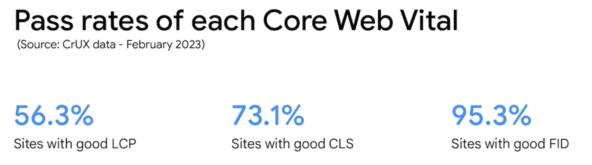
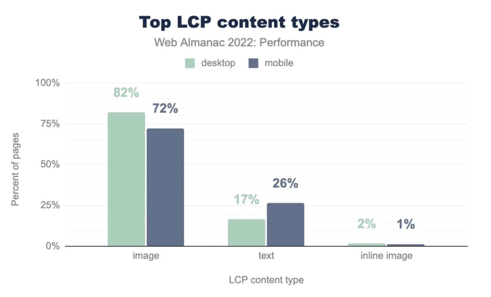

# 9个网页关键指标优化(9 most effective Core Web Vitals optimizations)

## LCP（Largest Contentful Paint） 最大内容渲染时间

### 什么是 LCP ？

视口内可见的最大图片或文本块的呈现时间（相对于网页首次开始加载的时间）

LCP 是大多数网站都难以达到的指标



大多数网站中 LCP 的内容主要是图片



由此我们就得到了第一个优化方案  

### 使用 `` 元素或预加载将图像纳入 HTML 中

需要注意的是，在目前主流的前端框架如 vue 中 `` 并不能被正确扫描到，因为框架最终会将所有代码编译为 javascript 因此也就不存在 img 标签。

可以通过 `<link rel="preload" href="" as="img">` 来预加载图片，但是我们只有一个 index.html 会一次性预加载所有图片，这样会导致首屏加载时间过长，而有些图片并不会一开始就被看到。

因此我们需要实现组件级的预加载，当我们需要加载某个组件时，再去预加载该组件的图片（在组件实例化之前就开始加载），这样就可以避免一次性加载所有图片，且还能够提前加载图片。

组件中的 img 标签和 link 标签都是在组件实例化之后才会被渲染，在实例化之前都是 javascript 代码，而浏览器是无法扫描 javascript 中的资源的，因此我们需要手动告知浏览器需要加载的资源有哪些。

通过 `new Image().src = ''` 可以立即触发图片的加载，相当于 `document.createElement('img')`(img 标签中有一个属性 loading，用于指示浏览器如何加载图像，默认值为 eager 表示立即加载)

我们只需要在路由切换之前执行 `new Image().src = ''` 即可，这样就可以在组件实例化之前就开始加载图片了，而不是等到组件实例化之后再去加载图片。

```ts
let cacheImages = new Map() // 尝试避免 gc 回收

/** 路由守卫 */
router.beforeEach((to, from, next) => {
  const preloadImages = to.meta?.preloadImages as string[]
  cacheImages.clear()
  /**
   * 图片预加载
   * @description 越过 js 代码分析，提前触发浏览器的图片加载机制
   * - chrome 中存在问题，当网络环境差时，开启高速 3G 节流模式时（或更慢），图片会加载两次，原因不详，尝试 corsOrigin、referrerPolicy 无果，疑似缓存未命中（缓存 key 组成不一致）或被清空
   * 停用节流模式时，预加载缓存正常命中，只加载一次图片。（ps: 这个节流模式 bug 真多）
   * - firefox 中不存在该问题，正常预加载一次图片，后续会正确显示命中缓存
   * 其他浏览器未测试
   */
  if (preloadImages.length) {
    preloadImages.forEach((item: string) => {
      const img = new Image()
      img.src = item
      // img.referrerPolicy = "no-referrer"
      // img.crossOrigin = "anonymous"
      cacheImages.set(item, img)
    })
  }

  next()
})
```