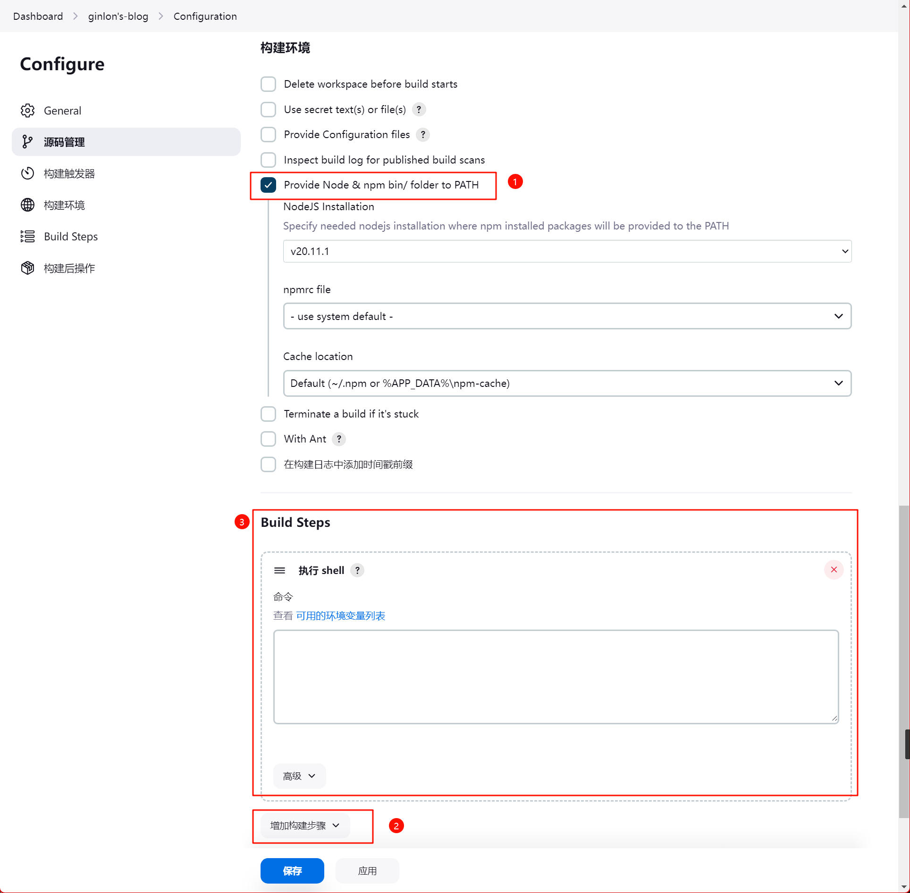

# CI/CD

文档地址： https://www.jenkins.io/doc/book/installing/docker/

## 搭建

### 启动 docker 容器(ubuntu)

创建一个网络用来连接 jenkins 和 docker:dind 容器

```bash
docker network create jenkins
```

启动 docker:dind 容器用来在 jenkins 中调用 docker 命令

```bash
docker run --name jenkins-docker \
--rm \
-d \
--privileged \
--network jenkins \
--network-alias docker \
--env DOCKER_TLS_CERTDIR=/certs \
-v jenkins-docker-certs:/certs/client \
-v jenkins-data:/var/jenkins_home \
-p 2376:2376 \
--storage-driver overlay2 \
docker:dind
```

启动 jenkins 容器

```bash
docker run --name jenkins-main \
--rm \
-d \
--network jenkins \
--env DOCKER_HOST=tcp://docker:2376 \
--env DOCKER_CERT_PATH=/certs/client \
--env DOCKER_TLS_VERIFY=1 \
-p 8080:8080 \
-p 50000:50000 \
-v jenkins-data:/var/jenkins_home \
-v jenkins-docker-certs:/certs/client:ro
jenkins/jenkins:lts-jdk17
```

> **踩坑:**
> 官网中文文档中使用的是 `jenkinsci/blueocean` 镜像，此镜像并非官方镜像，而是官方的自定义镜像安装了 blueocean 插件详见[在 Jenkins 官方文档中发现的"彩蛋"（Docker 篇）](https://juejin.cn/post/7154226427544469541)，该镜像已经长期没有维护，版本已经无法正常运行，目前最新的长期支持（LST）镜像是 `jenkins/jenkins:lts`。

打开浏览器访问 `http://localhost:8080`，输入初始密码，初始密码在容器中的 `/var/jenkins_home/secrets/initialAdminPassword` 文件中。

如果使用 docker 安装 jenkins，可以通过 `docker volume inspect jenkins-data` 查看容器挂载目录。

### 安装 node 插件

**Manage Jenkins -> Manage Plugins** 在可选插件中搜索 nodejs 选择对应插件进行安装，安装完成后需要重启才会生效。


然后到 **系统管理 -> 全局工具配置** 中配置 Node


修改刚刚创建的任务，构建环境中会多一个选项 `Provide Node & npm bin/ folder to PATH`，勾选后会将 node 和 npm 添加到环境变量中。

然后选择 **增加构建步骤 -> 执行 shell** 输入打包相关命令。**jenkins** 会逐行执行。



```bash
npm install pnpm -g
pnpm install
pnpm run docs:build
# 打包 build 后的文件
tar -zcvf dist.tar.gz dist/
# 删除 build 后的文件
rm -rf dist/
# 移动 build 后的压缩包到 nginx 托管目录下。
sudo mv dist.tar.gz /var/www/blog.com
# 进入托管目录下
cd /var/www/blog.com
# 解压
sudo tar -zxcf dist.tar.gz
# 删除压缩包
sudo rm -rf dist.tar.gz
```
