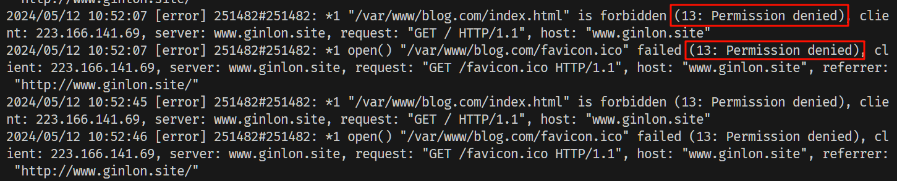
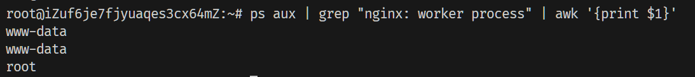
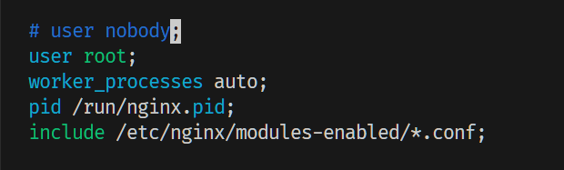

# nginx 配置

### 问题

#### 403 Forbidden

查看日志

```bash
vim /var/log/nginx/error.log
```

发现错误信息是：Permission denied



是由于启动用户和 nginx 工作用户不一致导致的，查看 nginx 启动用户

```bash
ps aux | grep "nginx: worker process" | awk '{print $1}'

# ps 报告当前系统的进程状态
#   a 显示所有用户的进程
#   u 以用户为主的格式来显示程序状况。
#   x 显示所有程序，不以终端机来区分。
# awk '{print $1}' 打印第一列
```



发现启动用户是 www-data

修改 nginx 配置，将 nginx 工作用户修改为 root


```bash
vim /etc/nginx/nginx.conf
```

修改 user 为 root

```bash
user root;
```
