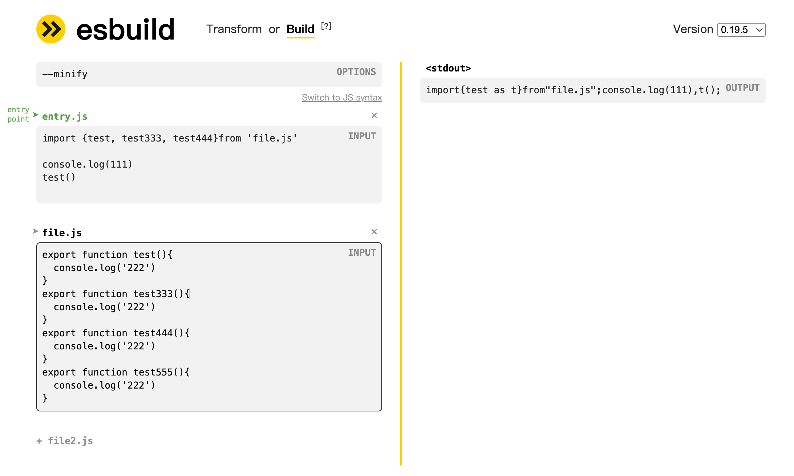

# 前端项目搭建

## 依赖库

Vite + Vue3 + TypeScript + element-plus + Pinia + lodash-es + dayjs

关于依赖库的选择， element-plus 是考虑到团队成员对 element 比较熟悉，且旧项目中使用了 element-ui，可以有比较好的延续性。

项目中经常需要处理时间的处理和格式转换，相比于 moment，dayjs 体积更小，且支持 tree-shaking，最重要的是 element-plus 中也依赖了 dayjs。

lodash-es 是 lodash 的 es6 模块版本，支持 tree-shaking，按需导入，同样 element-plus 中也依赖了 lodash-es。

使用这些组件库可以避免重复造轮子、免除 utils 的管理成本，提高开发效率，且这些库都拥有千万级的 weekly downloads（作为对比 vue 仅有 400w），可靠性有保障。

### 其他组件

#### 虚拟表格 [vxe-table](https://www.npmjs.com/package/vxe-table)

功能齐全的虚拟表格组件
支持 [sortablejs](https://www.npmjs.com/package/sortablejs) 实现拖拽功能。  
可以通过插件扩展功能，比如导出 excel、pdf

> 不建议使用，依赖 [exceljs](https://www.npmjs.com/package/exceljs) 体积过大（21.8MB），可以考虑使用 [xlsx](https://www.npmjs.com/package/xlsx)（7.5MB）自己实现

## minify

主流的代码压缩工具有 uglify、terser、esbuild  
其中 uglify-es 已经停止维护，uglify-js 不支持 ES6+  
terser 是基于 uglify-es 的分支迭代的新工具  
esbuild 是一个新的 JavaScript 打包器，它的目标是尽可能快地打包 JavaScript 代码，是 Vite 的默认选项

> 默认为 Esbuild，它比 terser 快 20-40 倍，压缩率只差 1%-2%。[Benchmarks](https://github.com/privatenumber/minification-benchmarks)

[build.minify](https://cn.vitejs.dev/config/build-options.html#build-minify)

这些工具都支持 [TreesShaking](https://developer.mozilla.org/zh-CN/docs/Glossary/Tree_shaking)



[esbuild try in browser](https://esbuild.github.io/try/)

vite 可以使用 [rollup-plugin-visualizer](https://www.npmjs.com/package/rollup-plugin-visualizer) 插件来可视化分析打包产物


## config

### vite.config.ts

typescript 不能正确的识别动态导入的 .vue 文件类型，需要在项目的类型声明中添加 .vue 文件的声明

```ts
// src/shims-vue.d.ts
declare module "*.vue" {
  import { ComponentOptions } from "vue";
  const componentOptions: ComponentOptions;
  export default componentOptions;
}
```

element-plus 的按需导入需要在 vite 中添加 unplugin-element-plus 插件

可以添加 unplugin-vue-components 自动导入组件，省去 import 但这很容易导致依赖不清晰，因此不建议使用，同理还有 unplugin-auto-import

添加 visualizer 插件可视化分析打包产物

### TypeScript

关键配置项

```json
{
  "compilerOptions": {
    "typeRoots": ["/@types", "./node_modules/@types"], // 指定声明文件的查找位置
    "paths": {
      "@/*": ["src/*"] // 指定模块的查找位置
    },
    "noImplicitAny": false, // typescript 会尝试推理变量的类型，如果不能够推理出来则会降隐式级为 any 类型，这个配置项可以禁止隐式的 any 类型，配置为 true 时，降级为 any 时会报错
    "noEmit": true // 不生成编译后的文件
  },
  "include": ["src/**/*.ts", "src/**/*.d.ts", "src/**/*.tsx", "src/**/*.vue"],
  "exclude": ["node_modules"],
  "references": [{ "path": "./tsconfig.node.json" }] // 引用其他 tsconfig.json
}
```

### eslint、prettier

eslint、prettier 均使用默认配置  
eslint 引入了部分预设，同时在 rules 中额外修改了部分过于严苛的规则，引入 eslint-config-prettier 插件避免 eslint 和 prettier 的规则冲突

```json
{
  "extends": [
    "eslint:recommended",
    "plugin:vue/vue3-essential",
    "plugin:@typescript-eslint/recommended",

    // prettier 放在最后，否则可能会被覆盖
    "prettier"
  ],
  "rules": {
    "vue/multi-word-component-names": "off",
    "@typescript-eslint/no-unused-vars": "warn",
    "@typescript-eslint/no-explicit-any": "off",
    "no-debugger": "warn"
  }
}
```

### lint-staged、husky

当在 package.json 中配置 lint-staged 时，lint-staged 执行的 vue-tsc 不能够正确的读取到项目中的 tsconfig 配置，需要使用单独的 .lintstagedrc.js 配置文件

```js
module.exports = {
  "*.{vue,ts,js}": () => {
    return [
      "vue-tsc --noEmit --skipLibCheck",
      "eslint --fix",
      "prettier . --write",
      "git add .", // eslint、prettier 会修改文件，需要重新 git add
    ];
  },
};
```

## optimize

- 使用按需导入 element-plus 和 @element-plus/icons-vue 节省体积 800kB+
  

- 使用预加载提升首屏渲染速度

```html
<link rel="preload" href="src/assets/images/header/bg_top.png" as="image" />
```

- 压缩图像

## Reference

[《Tree-Shaking 性能优化实践 - 原理篇》——百度外卖大前端技术团](https://juejin.cn/post/6844903544756109319?from=search-suggest#heading-0)
