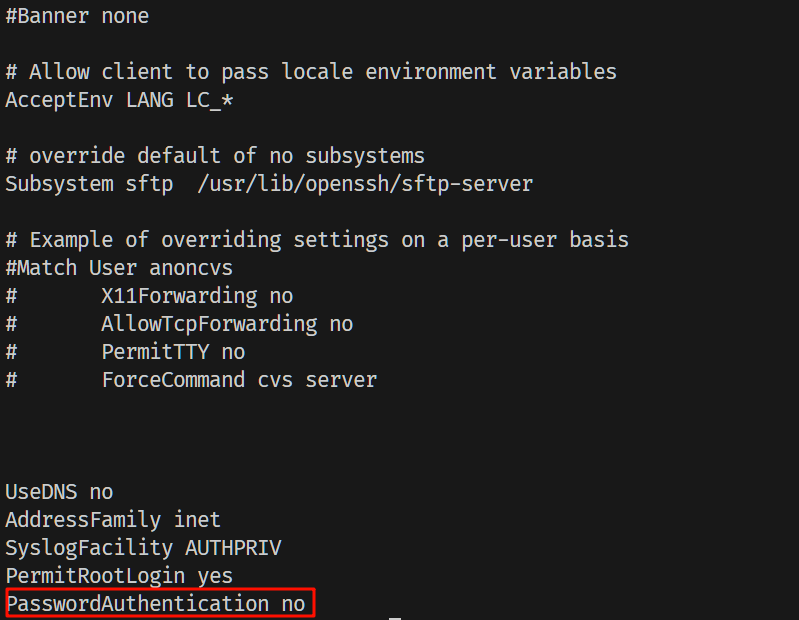

# 使用阿里云搭建个人服务器

## 购买服务器

1. 购买 ECS 服务
2. 重设服务器密码
3. 修改阿里云安全组配置，开放 80 端口

## 连接服务器

```bash
# 进入 root 模式
sudo -i
# 输入密码

# 连接服务器
ssh root@ip # root 是用户名，ip 是服务器公网 ip 或者域名
# 输入设置的密码
```

先更新 Ubuntu 防止安装找不到问题

```bash
apt-get update
```

### 安装 nvm

```bash
curl -o- https://raw.githubusercontent.com/nvm-sh/nvm/v0.39.5/install.sh | bash
```

`-o` 将下载内容输出到指定位置，`-` 表示输出到标准输出
`|` 管道操作符，将 `curl` 命令的输出传递给下一个命令
`bash` 命令行解释器，这里被用于执行安装脚本

### 安装 node

```bash
nvm install 18
```

### 安装 docker

[Install Docker Engine on Ubuntu](https://docs.docker.com/engine/install/ubuntu/#install-using-the-repository)

### 配置防火墙

```bash
ufw allow 'Nginx HTTP'

# ufw 用户友好的防火墙管理工具
```

### 安装 Nginx

```bash
apt-get install nginx
```

配置虚拟主机

```bash
# 创建网站目录
mkdir /var/www/example.com

# 在 /etc/nginx/sites-available/ 目录中创建一个新的虚拟主机配置
vim /etc/nginx/site-available/example.com.conf
```

```nginx
# 添加配置
server {
    listen 80; # 监听 IPv4 80 端口
    listen [::]:80; # 监听 IPv6 的 80 端口
    root /var/www/example.com; # 网站根目录
    index index.html index.htm; # 默认索引文件
    server_name example.com www.example.com; # 匹配域名
    # server_name _; # 默认虚拟主机，匹配所有请求
    location / {
        try_files $uri $uri/ =404; # 配置 URL路径处理
    }
}
```

启用 nginx 配置

nginx 通常将配置文件存储在 `/etc/nginx/sites-available/` 目录中
将配置文件的符号链接添加到 `/etc/nginx/sites-enabled/` 中即可启用配置

```bash
ln -s /etc/nginx/sites-available/example.com.conf /etc/nginx/sites-enabled/
# 默认建立硬链接
# -s 对源文件简历符号链接，而非硬链接
```

启动 nginx

```bash
systemctl start nginx

# 重新加载配置
system reload nginx
# 重启 nginx
systemctl restart nginx
# 查看 nginx 状态
systemctl status nginx
# 停止 nginx 服务
systemctl stop nginx

# systemctl 用于管理系统服务的命令行工具
# 启动自启动
systemctl enable <service_name>
# 禁用自启动
systemctl disable <service_name>
# 列出所有服务
systemctl list-units --type=service
# 查看日志
journalctl -u <service_name>
```

### 上传文件

使用 SCP 进行上传（路径反过来就是下载）：

- 打开终端，使用以下 scp 命令来将文件上传到服务器。假设您的程序文件位于本地的 /path/to/local/file，服务器上的目标目录是 /path/to/remote/directory，并且您有 SSH 访问权限。

```
scp -r -C /path/to/local/file/* username@server_ip:/var/www/example.com.conf

# -r 以递归方式复制
# -C 使用压缩
# -i identity_file 从指定文件中读取传输时使用的密钥文件（pem）
```

- /path/to/local/file 是本地文件的路径。
- username 是您在服务器上的用户名。
- server_ip 是服务器的 IP 地址。
- /path/to/remote/directory 是服务器上的目标目录。
- 输入服务器上的用户密码（如果需要），然后文件将被上传到服务器的指定目录。

### SSH 免密登录

1. 打开阿里云 ecs 控制台，找到 `网络与安全` > `密钥对`，创建密钥对并绑定到 ecs 实例，创建密钥对时保存 `.pem` 私钥文件到本地

2. 将私钥文件放到 `~/.ssh` 目录下，并设置权限

```bash
chmod 400 ~/.ssh/[.pem 文件名]
```

> chmod 修改文件权限
> 400 是权限的一种表示方式，第一位表示所有者的权限，第二位表示所有者所在组的权限，第三位表示其他用户的权限
> 4 表示读权限，2 表示写权限，1 表示执行权限，0 表示无权限（每个二进制位表示一种权限，可以组合使用，如 7 表示读写执行权限）
> -R 递归修改权限

此时可以使用 `ssh -i ~/.ssh/[.pem 文件名] root@ip` 命令登录服务器

1. 配置 `~/.ssh/config` 文件，添加别名

```bash
cd ~/.ssh
vim config
```

添加如下内容：

```bash
Host ecs # 实例别名
HostName [公网 ip] # 服务器公网 ip
User [登入用户名] # 登入用户名
IdentityFile ~/.ssh/[.pem 文件名] # 私钥文件路径
```

保存退出，重启 ssh 服务

```bash
service ssh restart
```

使用别名登入服务器

```bash
ssh ecs
```

> 注: 阿里云配置了密钥对后，默认不能使用密码登录，需要配置密码登录
> 登入服务器后，修改 `/etc/ssh/sshd_config` 文件，将 `PasswordAuthentication no` 改为 `PasswordAuthentication yes`，重启 ssh 服务
>
> 

## 参考

[使用第三方客户端通过密钥认证登录 Linux 实例](https://help.aliyun.com/zh/ecs/user-guide/connect-to-a-linux-instance-by-using-an-ssh-key-pair?spm=a2c4g.11186623.0.i9#concept-ucj-wrx-wdb)
